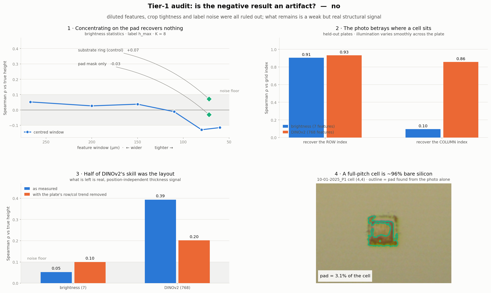

# Thickness-signal audit

**Question:** the earlier result said a photo cannot predict absolute sample
height once the substrate tilt is removed from the labels. Was that a real
limit, or an artifact of how I built the features?

**Answer:** real. Three candidate artifacts were tested and all three ruled out.
But the audit also found that **roughly half of DINOv2's apparent skill was
reading the plate layout, not thickness** — and that a weak, genuine,
position-independent signal does survive.



---

## Why this audit exists

The negative result rested on brightness features reaching Spearman ρ ≈ 0.05
against corrected labels. Before accepting that, three things had to be excluded:

1. **Diluted features.** Statistics were averaged over a whole 267 µm cell, but
   the polymer pad is far smaller. If absorption is the real cue, it was being
   averaged away against bare silicon.
2. **Crop tightness.** The results deck found tightening crops *hurt*
   (per-cell R² 0.77 → 0.59) and concluded surrounding context is real signal.
   That was measured on tilt-contaminated labels, where context also encodes
   plate position — so on corrected labels the conclusion might reverse.
3. **Label noise.** `h_max` is a single pixel standing in for a ~1 µm quantity.

A fourth question emerged from the results and was tested too: brightness finds
nothing but DINOv2 finds ρ ≈ 0.43, so **what is DINOv2 seeing?**

## The dilution was real — and worse than estimated

```
pad area / full-pitch cell area  =  3.9%   (median 4.0%, measured over 4416 cells)
```

So ~96% of every brightness statistic was bare substrate. The concern was
well-founded. Fixing it did not help.

## Result 1 & 2 — feature region (panel 1)

Feature window swept from the full cell pitch down to the pad footprint, plus a
data-driven pad mask, plus a **substrate-ring control** (the silicon immediately
around the pad, pad excluded).

| feature region | median R² | Spearman ρ |
|---|---|---|
| window 267 µm (full pitch) | −0.148 | **+0.052** |
| window 200 µm | −0.154 | +0.026 |
| window 150 µm | −0.160 | +0.038 |
| window 110 µm | −0.160 | −0.011 |
| window 80 µm | −0.173 | −0.129 |
| window 60 µm | −0.184 | −0.115 |
| pad mask (data-driven) | −0.188 | −0.030 |
| **substrate ring (control)** | −0.192 | **+0.071** |
| sharpness / focus measures | −0.166 | −0.090 |
| brightness + sharpness | −0.168 | −0.056 |

Two things settle it:

- **Tightening does not help; it drifts slightly worse.** Hypothesis 1 refuted,
  and hypothesis 2 answered — tighter is not better on corrected labels either.
- **The substrate ring scores highest of all (+0.071).** Bare silicon *next to*
  the pad predicts height as well as the pad itself. Whatever tiny signal exists
  is therefore **not** the pad's absorption. This is the most informative number
  in the audit: it rules out the physical mechanism, not just one implementation
  of it.

Every value sits inside the ±0.10 band that brightness features reach by chance.

### The focus idea, tested and dropped

Since brightness carried nothing but DINOv2 carried something, I hypothesised
**focus**: the lens has a very shallow depth of field, so a taller pad sits
closer to the focal plane and might render measurably sharper — depth-from-focus
happening by accident in a single frame.

Seven sharpness measures (Laplacian variance, Sobel magnitude, difference-of-
Gaussian energy ratio) give ρ = **−0.090**. No signal. Hand-crafted sharpness
is not the cue. *(This does not rule out a deliberate z-stack, where the focus
difference would be driven, large and measured on purpose — see Next steps.)*

## Result 3 — label definition (panel not shown; table below)

| label | median R² | Spearman ρ | roughness |
|---|---|---|---|
| `h_max` (previous choice) | −0.148 | +0.052 | 0.300 |
| `h_p95` | −0.144 | **+0.057** | 0.288 |
| `h_p99` | −0.148 | +0.048 | 0.300 |
| `h_maskmean` | −0.154 | +0.028 | **0.279** |

`h_p95` is marginally best and `h_maskmean` is marginally smoothest, but the
spread across all four is smaller than the noise. **Label noise is not the
bottleneck.** Hypothesis 3 refuted.

## Result 4 — what DINOv2 was actually reading (panels 2 & 3)

This is the finding that changes the interpretation.

**Step 1: can the features tell where a cell sits?** Out of sample, on held-out
plates:

| features | → row index | → column index |
|---|---|---|
| brightness (7) | ρ 0.905 | ρ 0.096 |
| **DINOv2 (768)** | **ρ 0.932** | **ρ 0.858** |

DINOv2 recovers a cell's grid coordinates almost perfectly from the photo alone.
That is the illumination field, which varies smoothly across the plate.

**Step 2: does the prediction survive removing position?** Each plate's own
(row, col) linear trend was subtracted from the label, leaving only variation
that is independent of where a cell sits:

| features | as measured | position removed |
|---|---|---|
| brightness (7) | ρ 0.052 | ρ 0.100 |
| **DINOv2 (768)** | **ρ 0.393** | **ρ 0.202** |

**About half of DINOv2's skill was the layout.** The formulation layout is
systematic, so knowing *where* a cell is partly tells you *how thick* it is —
without measuring thickness. That would not transfer to a plate laid out
differently, and it cannot rank two cells of the same formulation.

But ρ = **0.202** survives, against a 0.10 noise floor. That is a real,
position-independent thickness signal — and it is **structural, not
intensity-based**, since fourteen brightness and sharpness numbers never find it.

## What this means

| | |
|---|---|
| ❌ Diluted features | refuted — tightening makes it slightly worse |
| ❌ Crop tightness | refuted — tighter is not better on corrected labels |
| ❌ Label noise | refuted — all four label variants within noise of each other |
| ❌ Absorption is the cue | refuted — bare substrate beside the pad predicts as well as the pad |
| ❌ Hand-crafted focus | refuted — ρ −0.090 |
| ⚠️ DINOv2's ρ 0.39 | about half was plate layout, not thickness |
| ✅ Real signal exists | ρ ≈ 0.20, position-independent, structural |

**The negative result stands, and is now much better supported.** A single
flat-lit photo carries some genuine thickness information, but it is weak, it is
not absorption, and it is not enough for absolute heights.

Two corrections this audit forces on the earlier write-up:

- The headline "ranking works at ρ ≈ 0.42" should be **ρ ≈ 0.20**. Roughly half
  of the 0.42 was positional.
- Any future evaluation must include the position control. Without it, a model
  that has merely learned the illumination gradient looks like a model that has
  learned thickness.

## Next steps

The audit closes the "make the features better" avenue. What remains is to give
the camera a real depth cue:

1. **Depth from focus, deliberately.** Hand-crafted sharpness on a *single*
   frame finds nothing — but that frame was not taken at a controlled z. A
   z-stack turns focus from an accident into a measurement, and the motorised
   stage being built for the mirrored view provides it with no new hardware.
2. **Oblique illumination.** One LED at a known low angle: shadow length =
   height ÷ tan(angle). At 20° a 10 µm pad throws a ~27 µm shadow ≈ 25 px.
   Geometric, no model needed, roughly a $20 experiment.
3. **Reference patches.** Still necessary for absolute scale, still not
   sufficient alone: even with perfect µ and σ, per-cell prediction at ρ 0.20
   gives R² ≈ 0.04.
4. **Per-formulation rather than per-cell.** Between-plate variation (2.3 µm SD)
   is more than twice within-plate (1.0 µm SD), and "did formulation X hit
   spec?" is closer to the lab's actual question. Untested here, and the
   cheapest remaining reframing.

## Caveats

- ρ = 0.202 is a median over 69 held-out plates. It is well above the 0.10
  noise floor but it is not a large effect, and no confidence interval is
  computed here.
- Removing a per-plate *linear* (row, col) trend leaves any non-linear layout
  effect in place, so 0.202 is an **upper bound** on position-independent signal.
- The "roughness" column is a proxy — the median absolute difference between a
  cell and its four grid neighbours. Neighbours are different formulations, so
  it is not pure noise; it is comparable across label variants but not absolute.
- `h_max` was used as the label throughout the feature sweep, for comparability
  with the earlier result. The label sweep shows the choice barely matters.
- Everything is derived from corrected, plane-relative labels produced by
  `src/Auto_OPDx/alignment/`. If that pipeline is wrong, so is this.

## Layout and reproducing

```
studies/02-thickness-signal-audit/
├── README.md                     this file
├── src/
│   ├── build_features.py         one pass over 69 plates -> features + labels
│   ├── evaluate.py               LOPO over feature regions and label variants
│   ├── position_control.py       the position-leakage test
│   └── make_figures.py           renders figures/audit_summary.png
├── results/
│   ├── cells_audit.csv           4416 cells x all feature variants
│   ├── evaluation.csv            experiments 1-3
│   ├── position_control.csv      experiment 4, step 2
│   └── position_recovery.csv     experiment 4, step 1
├── figures/
│   └── audit_summary.png
└── audit.ipynb                   interactive walkthrough of the same results
```

```bash
# from the repo root; needs scripts/04_dinov2_features.py to have been run first
uv run python studies/02-thickness-signal-audit/src/build_features.py     # ~5 min
uv run python studies/02-thickness-signal-audit/src/evaluate.py           # ~3 min
uv run python studies/02-thickness-signal-audit/src/position_control.py   # ~4 min
uv run python studies/02-thickness-signal-audit/src/make_figures.py
```

Protocol, identical across every row above so differences are attributable:
leave-one-plate-out over 69 plates; features centred per plate (uses no labels,
so legal at deployment); the model predicts a standardised deviation and K = 8
measured cells supply the mean and spread; those K cells are excluded from
scoring; ridge alpha chosen on a grouped split of the *training* plates only.
